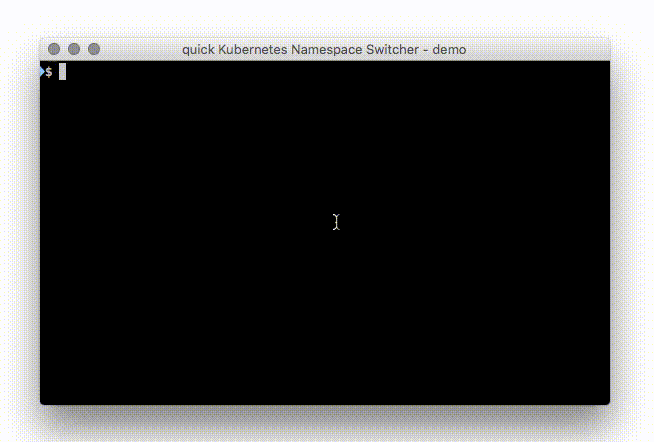

# kns - quick Kubernetes Namespace Switcher
**kns** is a very small shellscript that utilizes [fzf](https://git.io/C4FBDw)
to switch between Kubernetes namespaces blazing fast. :fire:

## Demo


## Installation
To install **kns** you can just run this command:
```bash
curl https://raw.githubusercontent.com/blendle/kns/master/kns -o /usr/local/bin/kns && chmod +x $_
```
Or use our homebrew tap:
```bash
$ brew tap blendle/blendle
$ brew install kns
```
That's it! Done! :raised_hands:

### ktx - the quick context switcher

For those of you that deal with a lot of clusters regularly, there's also `ktx` to switch
between contexts. It does not connect to any api-server, but only displays information from
`kubectl` configuration. It is included in the homebrew package (see above). For manual
installation:
```bash
curl https://raw.githubusercontent.com/blendle/kns/master/ktx -o /usr/local/bin/ktx && chmod +x $_
```
